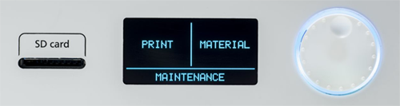

# HOWTO 3D Start-up: Ultimaker 2+
##### Last Update: Feb 26, 2017

## Required
- 3D model in .stl format.  Typically created by Cura or downloaded from web sites such as Thingiverse
- Material.  PLA, others
- SD Card with model loaded

## Control Panel

## Printer Start-up
1. Turn power on

- Mount spool on rear of printer
- 

  