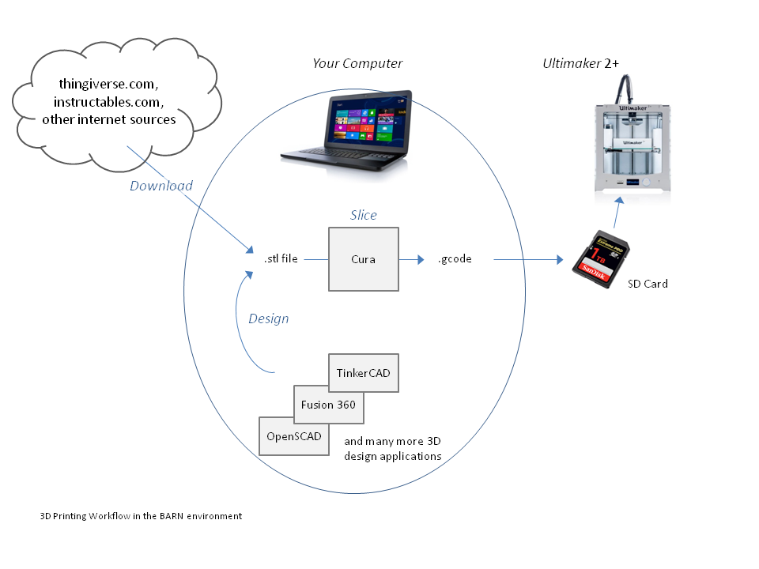

  

# HOWTO: 3D Printing - Material, Slicing, Design Reference

## Overview of 3d Printing  

  

The __.stl__ (StereoLithography) file format is a typical output of the design process though each design app uses different file formats within the design project.  "STL files describe only the surface geometry of a three-dimensional object without any representation of color, texture or other common CAD model attributes.", Wikipedia

The __.gcode__ file format used by Ultimaker is a derivative of G-Code originally created for CNC machining.  It defines each layer to be printed with printhead positioning and movement.

## Material

__PLA__ (polylactic acid) is one of the most widely used 3D printing materials and also the recommended material for beginners. It prints fast, it is safe and can be used for a broad range of models and applications.  OK for contact with food - see link below.

__Nylon__ (polyamide) is widely used by manufacturers to 3D print strong end-use parts and functional prototypes that require durability and abrasion resistance.

__ABS__ (acrylonitrile butadiene styrene) is a frequently used 3D printing material. It has good mechanical properties and can be used for a wide range of applications.

__CPE__ (co-polyester) is a chemical resistant and relatively tough material that is widely used for functional prototyping and modeling

__PVA__ (polyvinyl alcohol) is a 3D printing material commonly used to create water soluble support structures to achieve complex geometries.

__PC__ (polycarbonate) is a very strong and tough material that can be used for various engineering applications.

__TPU__ (thermoplastic polyurethane) is a semi-flexible material that can be used in a wide variety of engineering projects where easier and faster printing is more important than aesthetic qualities.

[Extensive Material Comparison (all3dp.com)](https://all3dp.com/best-3d-printer-filament-types-pla-abs-pet-exotic-wood-metal/)

[3D Printing and Food Safety](https://pinshape.com/blog/3d-printing-food-safe/)

## Slicing

Cura is a slicing app developed by a member of the Ultimaker community.  While other slicing apps can be used, Cura is the primary app used in the BARN ETA studio.  It accepts an .stl formated file and prepares it for printing by creating a .gcode file.

When an .stl file is loaded, it is visually placed on the print bed.  By using the toolbar and/or the mouse you can:
- Move the model
- Scale the model
- Rotate model through all three axis
- Mirror the model
- Set custom print settings for this model

The model can be viewed as:
- A solid figure
- Xray view of the internal model
- Layer view of the model allowing you to scroll through the layers to see the details of the printing process.

For the Ultimaker, you set:
- The nozzle size mounted on the printer, typically 0.4mm.
- The material being used, most typically PLA.
- The printing Profile - Fast Print, Normal Quality, High Quality.  While affecting quality, it significantly affects the print time.
- The general Print Setup profile to use - Recommended, Custom.  The Recommended profile is usually appropriate.

While using the default settings is successful for most prints, it is best to review the [Cura Tutorial (all3dp.com)](https://all3dp.com/cura-tutorial-3d-printing/) for more extensive understanding of its use.

## Print Fails

Following are some common problems and how to address them mostly with Cura Custom Settings.  (This content comes from the Ultimaker website where there is additional info.)

### Under Extrusion

Under-extrusion is when the printer is unable to supply the right amount of material. You’ll know if your printer is under-extruding if you see missing layers, very thin layers, or layers that have random dots and holes in them.

- __Settings.__  Ensure the various settings match the material chosen and printer nozzle being used.

- __Printer Setup.__  Ensure material is mounted and feeding correctly.

- [Read Ultimaker manual on this topic](https://ultimaker.com/en/resources/21477-how-to-fix-under-extrusion)

### Pillowing ###

The top surface of a print is not completely closed or shows bumps.

- __Cura: Top/Bottom thickness.__  Use a Top/Bottom thickness of at least 6 times the layer height to properly close your model if it has a flat top surface.

- __Cura: Cooling.__  Make sure the print head fans are running at the maximum fan speed as set in the cooling settings in Cura. If they don’t, the plastic might not cool properly through which it may hang down a bit or curl up at the places where it crosses the infill lines.

### Stringing ###

3D prints sometimes show small strands/"hairs" of plastic on places where the print head travel from one place to another and no printing should occur.

- __Cura: Enable Retraction.__  At the places in a print where the printer has to travel between two printed parts and you don’t want it to leave plastic in its wake, use retraction. This means the filament is pulled back a little bit by the feeder, so that it doesn’t leak from the nozzle during the travel moves.

- __Cura: Temperature.__ Temperature is key to causing or curing  stringing. A high temperature means that the material will be more liquid, through which it can easily drip from the nozzle (even though retracted). By using a lower temperature the material is less liquid and thus less likely to string. Lower the temperature in steps of approximately 10 degrees to find out what the best setting for your material.

- __Cura: Print Speed.__  Print speed also plays role. If you lowered the temperature there’s a chance that your material starts under extruding when still printing at a (too) high speed. Therefore it’s recommended to reduce the print speed accordingly possibly to 20 mm/s.

- __Cura: Travel Speed.__  Increased travel speed may help so that the material has less time to drip from the nozzle while traveling. A travel speed of 200 mm/s should be fine for most prints.

## Design

There are a wide variety of 3D modeling applications to choose from and as many opinions on which to choose.  Following is highlighted from a post on Thingiverse and reflects some relatively common recommendations - only the free, opensource options are listed here.  [Opinion on 3D design software (thingiverse.com)](https://www.gliffy.com/go/publish/5271448)

Before settling on an app, see what others have to say ([Google search](https://www.google.com/webhp?sourceid=chrome-instant&ion=1&espv=2&ie=UTF-8#newwindow=1&q=3d+design+software+for+3d+printers&*)).

| App    | Level    |  Use  |  Comments |
| ---------- | -----------    |  ---------  |  --------- |
| TinkerCAD  | Beginner, Intermediate  | Precise shapes  | Starting point for beginners, yet provides good capabilities
| Fusion 360 | Intermediate, Advanced  | Precise shapes  | Fairly long learning curve, but many adherents
| OpenScad   | Intermediate  | Precise shapes  | 3D design through programming
| DesignSpark Mechanical| Intermediate | Precise shapes  | Choice of Thingivers poster
| Blender    | Advanced                | Organic designs | Most comprehensive with longest learning curve

See also ...

[22 Best 3D Modeling Software Tools (all3dp.com)](https://all3dp.com/best-3d-modeling-software/#Fusion%20360)

## References

[3D Hubs Knowledge Base](https://www.3dhubs.com/knowledge-base/)

[All About 3D Printing (all3dp.com)](https://all3dp.com/basics/)

[20 best 3D printing software](https://all3dp.com/best-3d-printing-software-tools/)

