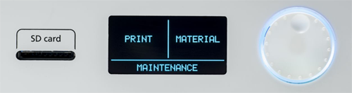

  

# Note
We no longer have an Ultimaker in the lab, but left this here for the moment.

# HOWTO: 3D Printing - Using Ultimaker 2+

__Use of printer.__
The 3D printer is available to be used by all BARN members that have been certified by ETA.  This is most easily done by attending a BARN 3D Printing Basics class and then demonstrating to an ETA Steering Committee member that you can safely use the equipment and supplies.

__Use of printer filament.__
The filament available for 3D printing has been provided by individual members of ETA.  Unless a spool is otherwise marked, it is available to be used by a BARN member. If you have done or plan to do a number of prints, please consider contributing a spool to the studio cache.  You could replace a spool that is running low or add a new/novel color or material.

Print projects typically take one or more hours to complete.  Please be considerate of others also wanting to use the printer.

## Getting Started

You will need the following before starting the print job

- A 3D model in .gcode format.  Typically an .stl file is sliced by Cura to create a printable .gcode file.
- Material.  PLA, Nylon, others.  See [Manual: Materials](https://ultimaker.com/en/resources/manuals/materials)
- SD Card with .gcode model loaded

## Print

1. **Turn power on** with rocker switch on back of unit.  The MAIN control panel with PRINT | MATERIAL | MAINTENANCE will display
2. **Mount SD card** containing .gcode file to be printed.
3. **Remove material** if a different material is required. 
	- On Control Panel press MATERIAL - new panel of options is displayed
	- Press CHANGE and the current material will be retracted
	- Remove the spool and press READY
	- A message to mount new material will display
4. **Mount new material** if required
	- Mount new filament spool on back of printer with material feeding from bottom of spool toward feed tube. Be carefull that material is free to feed and is not wrapped underneath another strand of material on the spool.
	- Insert the end of the filament into the bottom of the feeder and push it until the filament is grabbed by the feeder.  
	- Press READY to begin feeding material.  Lightly hold material to feel if it is feeding.
	- When material begins to extrude and previous color of material has been replaced by selected color, press READY.
	- A panel to select the material profile is displayed.  
7.  **Select file to print**.  
	- Select PRINT from the control panel 
	- Use the dial to scan through SD card contents until file is located.  
	- When found depress the dial to select it.
	- The print head will heat up.  When ready the base will rise to the print head and the printing will start.

## Control Panel  

The Control Panel has a slot for the SD card, a display to show options, and a rotory disk to move between options and then selecting an option by pressing the disk.

## References  

- [Ultimaker Manual](https://ultimaker.com/en/resources/manuals)

